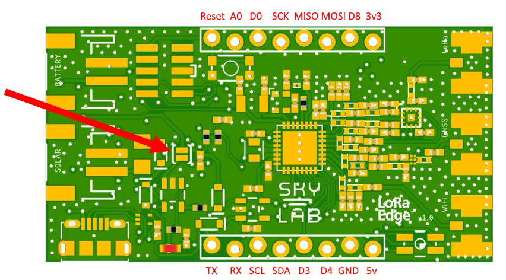

# LoRaEdge_BasicTracking

WARNING: When connecting a solar panel or a battery the polarity of the pins should be as follows:

WARNING: If the charge controller for a li-ion battery is needed, the battery jumper must be connected:

##	Configure Arduino IDE

The Arduino IDE can be used for uploading software via the micro USB port. Before it can be used the IDE must be configured. 
The first thing is to install the board via board manager.
Go to File -> Preferences. Add the following link to Additional Boards Manager URLs: 
https://github.com/SkyLabIoT/LoRaEdge_BasicTracking/raw/master/package_skylab_index.json.
The board package can be downloaded via Tools -> Board -> Boards Manager... by searching for SkyLab.
Select the board via Tools -> Board -> SkyLab Boards -> SkyLab LoRa Edge.
The example sketch can be loaded via File -> Examples -> SkyLab LoRa Edge -> BasicLoRaA.

The BasicLoRaA sketch dependencies are: \
Arduino SAMD21 Low Power library: https://www.arduino.cc/en/Reference/ArduinoLowPower \
Arduino RTC library: https://www.arduino.cc/en/Reference/RTC \
Adafruit BME280 library: https://github.com/adafruit/Adafruit_BME280_Library \
Adafruit LMS303 accelerometer library: https://github.com/adafruit/Adafruit_LSM303_Accel \
FlashStorage library by cmaglie: https://github.com/cmaglie/FlashStorage

##	Joining network
After uploading the mode A example sketch the serial monitor can be opened on a 9600 baud rate. The system starts with displaying the configured dev_eui, join_eui and app_key (msb first). The dev_eui is requested from the LR1110 chip and is unique to that specific chip. This key should be used in the console of the used network. The join_eui and app_key are configured in the code and should be changed for the correct keys, given by the used network console. If configured correctly the device automatically joins.
##	Configure via downlink
### On port 1 (only with BasicLoRaA version > 1.5.3):

Send a 0x01 to request a Wi-Fi and GNSS scan payload (answer is on port 2 and 3). \
Send a 0x02 to request the current configuration (answer is on port 44). \
Send a 0x03 to request the current battery voltage (answer is on port 10).

### On port 2:

The configuration downlink format should be as follows:

0 |	1-2 | 3 | 4 | 5 | 6 | 7 | 8 | 9
--|--|--|--|--|--|--|--|--
LED | Interval | Beacon | Wi-Fi | GNSS | Motion activation / time | Motion interval duration | Motion sensor threshold register | Motion sensor duration register

Byte 0: LED
This byte configures the status LED.
* 0 = OFF
* 1 = ON (during Wi-Fi scan and GNSS scan)
* Others = keep current setting

Byte 1 and 2: Interval
These 2 bytes configure the standard interval time between messages
Time is in minutes. Interval set to 0 will keep current setting and will not set an new interval time. Maximum time is 65535 minutes.

Byte 3: Beacon
This byte configures the time that de beacon is turned on. Time is in minutes. Maximum time is 255 minutes.
When set to 0 the beacon will not be turned on. 

Byte 4: Wi-Fi
This byte turns the Wi-Fi payload on or off.
* 0 = OFF
* 1 = ON
* Others = keep current setting

Byte 5:  GNSS
This byte turns the GNSS payload on or off.
* 0 = OFF
* 1 = ON
* Others = keep current setting

Byte 6:  Motion activation / time
This byte sets the send interval if motion is detected. Time is in minutes with a maximum of 255.
When set to 0 motion detection interrupt is disabled.

Byte 7:  Motion interval duration
This byte sets the duration the system uses the motion interval after last motion detection. Time is in minutes with a maximum of 255.
When set to 0 this byte will be ignored (current settings will be used).

Byte 8:  Motion sensor threshold register
This byte sets the motion sensor threshold register. If byte 7 is set to 0 this byte will be ignored (current settings will be used).

Byte 9:  Motion sensor duration register
This byte sets the motion sensor duration register. If byte 7 is set to 0 this byte will be ignored (current settings will be used)

The system confirms the downlink by sending the set configuration in an uplink on port 44 in the same format as the downlink. 

#### Downlink examples:
LED on, interval on 5 minutes, no beacon, Wi-Fi and GNSS payload on, motion detection off: 01 00 05 00 01 01 00 00 00 00

LED off, interval 600 minutes, no beacon, Wi-Fi payload on, GNSS payload off, motion detection off: 00 15 36 00 01 00 00 00 00 00

Keep current LED and interval setting, no beacon, Wi-Fi payload off, GNSS payload on, motion detection off: 02 00 00 00 00 01 00 00 00 00

Turn beacon on for 5 minutes, motion detection off, keep all other current settings: 02 00 00 05 02 02 00 00 00 00

Keep current LED and interval setting, no beacon, Wi-Fi payload on, GNSS payload off, motion detection on with 1 minute sending interval, motion interval used for 4 minutes after last motion, motion threshold register set to 7, motion duration register set to 3: 02 00 00 00 01 00 01 04 07 03

##	Uplink format
The mode A example sketch can send 4 types of payload. These payloads types are identifiable by the port number used. An example TTN decoder script can be found on this GitHub page (exampleDecoderTTN.js).

### On port 2:
This is the Wi-Fi and sensor payload. This payload has the information of 3 Wi-Fi points and the sensor data. The format is as follows:

0 |	1-6 |	7	| 8-13 |	14 |	15-20 |	21 | 22-23 | 24-25 | 26 | 27
--|--|--|--|--|--|--|--|--|--|--
RSSI 1 |	MAC 1 |	RSSI 2 |	MAC 2 |	RSSI 3 |	MAC 3 |	Battery voltage | Temperature | Pressure | Humidity | Motion activation

Byte 0, 7 and 14:
These bytes have the RSSI / signal strength of the scanned Wi-Fi points. These values must be interpreted as signed integers.

Byte 1 to 6, 8 to 13 and 15 to 20:
These bytes have the MAC addresses of the scanned Wi-Fi points.

Byte 21: Battery voltage
This byte has the raw battery voltage value. The exact voltage can be calculated with: 
voltage = (float)((3.3 / 255) * ((4.7 + 10) / 10) * (Battery voltage));

Byte 22 to 23: Temperature
These bytes have the temperature value. The exact temperature in degree Celsius (◦C) can be calculated with: 
Temperature = (float)(Temperature / 100);

Byte 24 to 25: Pressure
These bytes have the air pressure value. The exact pressure in degree hector Pascal (hPa) can be calculated with: 
Air pressure = (float)(Pressure / 10);

Byte 26: Humidity
This byte has the humidity value in %.

Byte 27: Motion activation
This byte shows 0 when in normal interval. When in motion interval this byte gives the amount of minutes left in the motion interval.

### On port 3:
This is the GNSS payload. This payload only has the raw GNSS data and is variable in size.

### On port 10:
This payload is used as a “I am awake” message. By default it is set to every 24 hours. This can be changed by changing the value “controlTime”. The format is as follows: 

Byte 0: Battery voltage
This byte has the raw battery voltage value. The exact voltage can be calculated with: 
voltage = (float)((3.3 / 255) * ((4.7 + 10) / 10) * (Battery voltage));

### On port 199:
The LR1110 sends an automated message when joining and every 24 hours after that. This message can be ignored.

### Radio beacon:
When the beacon setting is set to 1 the beacon will be activated. The device will leave the network and sends a random LoRa payload every second on the 869800000 Hz frequency (outside the official LoRa frequency). The green LED will turn on if the LED activation is set to 1. The beacon will stop when the set time is reached. The system will rejoin the network and operate as before. 

## Hardware pins
uC pin	| Board pin	|	Name in Arduino IDE
--|--|--
PA02	|	A0 |	A0, DAC0
PA05	|	AIN5 (battery)	|	AIN5
PA06	|	D0	|	D0
PA07	|	D8	|	D8
PA08	|	D3	|	D3
PA09	|	D4	|	D4
PA10	|	Busy (LR1110)	|	BUSY
PA11	|	Event (LR1110)	|	EVENT
PA14	|	NRESET (LR1110)	|	NRESET
PA15	|	LED Red	|	LEDR
PA16	|	MOSI	|	MOSI
PA17	|	SCK	|	SCK
PA18	|	NSS (LR1110)	|	NSS
PA19	|	MISO	|	MISO
PA20	|	INT2 (LSM303AGR)	|	INT2
PA21	|	INT1 (LSM303AGR)	|	INT1
PA22	|	SDA	|	SDA
PA23	|	SCL	|	SCL
PA24	|	D- (usb)	|	PIN_USB_DM
PA25	|	D+ (usb)	|	PIN_USB_DP
PA27	|	PA27 (pad)	|	PA27
PA28	|	PA28 (pad)	|	PA28
PA30	|	SWDCLK/TCK (debug pins)	|	-
PA31	|	SWDIO/TMS (debug pins)	|	-
PB02	|	PB02 (pad)	|	PB02
PB03	|	PB03 (pad)	|	PB03
PB08	|	LNA (GNSS)	|	LNA
PB09	|	INT3 (LSM303AGR)	|	INT3
PB10	|	LED Green	|	LEDG
PB11	|	LED Blue	|	LEDB
PB22	|	TX	|	PIN_SERIAL_TX 
PB23	|	RX	|	PIN_SERIAL_RX 

## Changelog
Version | Changes
--|--
1.0 | First release.
1.2 | Support for more configuration via downlink, sensor integration in Wi-Fi payload and radio beacon.
1.3 | Changes for BasicLoRaA sketch: Changed downlink to take fewer bytes. Fix a battery draining joining issue when there is no LoRa coverage. Added support for motion detection, enable by setting motionActivation to 1.
1.3.1 | Fixed joining issue after a failed join in BasicLoRaA sketch.
1.4 | Updated port 2 uplink (byte 27). Updated downlink format, including examples. Added downlink confirm uplink. Ability to save settings to EEPROM so they will not reset on reboot.
1.4.1 | File cleanup.
1.5 |Purple LED turns on when attempting to join. Fix for missing Wi-Fi payload bug. Support for alc sync for future use. Made code more readable by adding comments.
1.5.1 | Padded EUI / keys with zeros on serial monitor for easier copying. LoRaWAN, firmware and bootloader versions now print in HEX on serial monitor.
1.5.2 | Fixed not sending first payload after startup and after first motion detection.
1.5.3 | Added downlink function for requesting settings. Fixed bug in motion interval timer.

